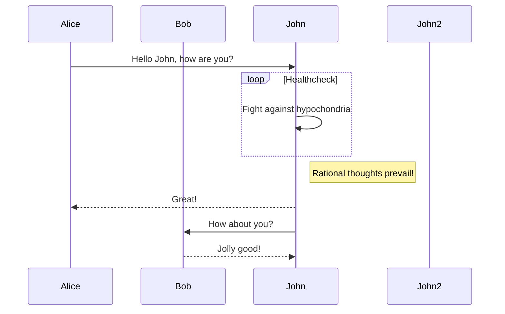
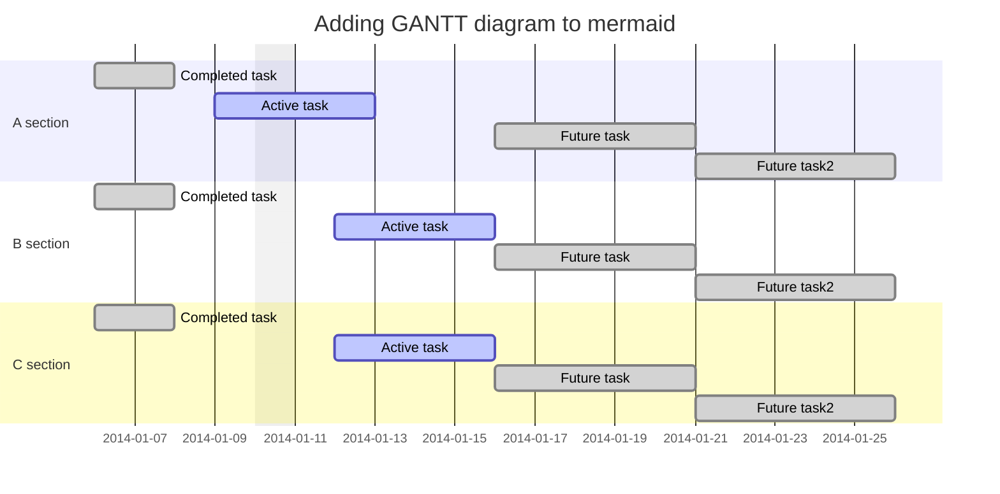
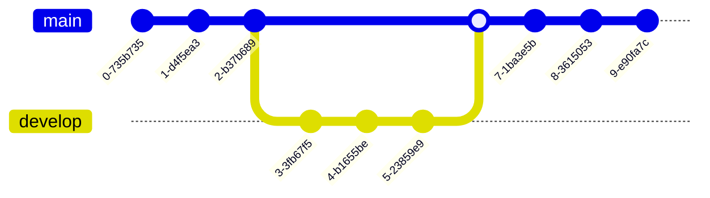

```mermaid
sequenceDiagram
    participant Alice
    participant Bob
    participant John
    participant John2


    Alice->>John: Hello John, how are you?
    loop Healthcheck
        John->>John: Fight against hypochondria
    end
    Note right of John: Rational thoughts prevail!
    John-->>Alice: Great!
    John->>Bob: How about you?
    Bob-->>John: Jolly good!
```

```mermaid
gantt
    dateFormat  YYYY-MM-DD
    title Adding GANTT diagram to mermaid
    excludes weekdays 2014-01-10

    section A section
        Completed task            :done,    des1, 2014-01-06,2014-01-08
        Active task               :active,  des2, 2014-01-09, 3d
        Future task               :done,    des3, after des2, 5d
        Future task2              :done,    des4, after des3, 5d

    section B section
        Completed task            :done,    des1, 2014-01-06,2014-01-08
        Active task               :active,  des2, 2014-01-12, 4d
        Future task               :done,    des3, after des2, 5d
        Future task2              :done,    des4, after des3, 5d
    
    section C section
        Completed task            :done,    des1, 2014-01-06,2014-01-08
        Active task               :active,  des2, 2014-01-12, 4d
        Future task               :done,    des3, after des2, 5d
        Future task2              :done,    des4, after des3, 5d
```

```mermaid
gitGraph
       commit
       commit
       commit
       branch develop
       checkout develop
       commit
       commit
       commit
       checkout main
       merge develop
       commit
       commit
       commit
```